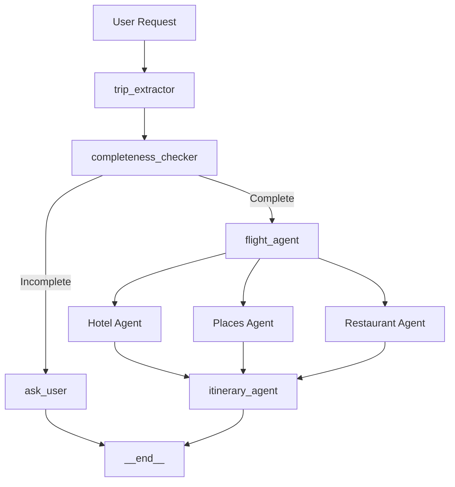

# ✈️ Voyage AI — AI-Powered Travel Planner

> An AI-powered travel planning application that turns natural-language travel requests into personalized, budget-aware itineraries using a multi-agent LangGraph workflow, Google Gemini, real-time travel APIs, and a React frontend.

**Live Demo:** https://voyageai-rust.vercel.app/

**GitHub:** https://github.com/ArmanKhan-git/AI-Trip-Planner

---

## 📌 Overview

Voyage AI automates the process of planning a complete trip.

Instead of manually searching for flights, hotels, restaurants, attractions, prices, and travel information, users can provide a request such as:

> "Plan a 7-day trip from Delhi to Tokyo for 2 people with a budget of ₹5,00,000."

Voyage AI extracts the trip requirements, gathers relevant travel data, compares available options, estimates the total cost, and generates a personalized day-by-day itinerary.

The application combines **LLMs, multi-agent workflows, external APIs, structured outputs, and budget optimization** into one end-to-end AI application.

---

## ✨ Features

### 🤖 AI-Powered Trip Planning
- Understands natural-language travel requests.
- Extracts destination, departure city, duration, budget, travelers, and travel dates.
- Handles missing information through conversational follow-up.
- Generates personalized day-by-day itineraries.

### ✈️ Flight Recommendations
- Integrates the Duffel Flight API.
- Retrieves available flight options.
- Compares airlines, prices, duration, and stops.
- Selects a suitable flight based on trip requirements.

### 🏨 Hotel Recommendations
- Searches hotel options for the destination.
- Considers hotel ratings and review popularity.
- Estimates accommodation costs.
- Provides hotel comparison options.

### 🍜 Restaurant Recommendations
- Uses location-based restaurant data.
- Recommends restaurants based on itinerary locations.
- Provides multiple restaurant options.
- Supports `$`, `$$`, `$$$`, and `$$$$` price categories.
- Calculates estimated dining costs and potential savings between options.

### 📍 Tourist Attractions
- Finds attractions relevant to the destination.
- Incorporates attractions into the day-wise itinerary.
- Organizes activities across morning, afternoon, and evening.

### 💰 Budget Optimization
Voyage AI breaks estimated trip cost into:

```text
Flights
Hotels
Food
Transportation
Miscellaneous
----------------
Total Trip Cost
Remaining Budget
```

It also determines whether the proposed trip is affordable within the user's budget.

### 📊 Comparisons
Users can compare:
- Flights
- Hotels
- Restaurants

and understand the cost difference between alternatives.

### 📈 AI Observability
The LangGraph workflow is instrumented with **LangSmith** to monitor:
- Agent execution
- State transitions
- Latency
- Token usage
- LLM calls
- Workflow performance
- Cost

---

## 🧠 Architecture

Voyage AI uses **LangGraph** to coordinate specialized agents and workflow nodes.

```text
                         User
                          │
                          ▼
                 ┌─────────────────┐
                 │   React + Vite  │
                 │    Frontend     │
                 └────────┬────────┘
                          │
                          │ REST API
                          ▼
                 ┌─────────────────┐
                 │     FastAPI     │
                 │     Backend     │
                 └────────┬────────┘
                          │
                          ▼
                 ┌────────────────────────┐
                 │       LangGraph        │
                 │    Agentic Workflow    │
                 └───────────┬────────────┘
                             │
       ┌─────────────────────┼─────────────────────┐
       │                     │                     │
       ▼                     ▼                     ▼
 Destination            Flight Agent         Hotel Agent
 Agent
       │                     │                     │
       │                     ▼                     ▼
       │              Duffel Flight API       Hotel Data
       │
       ▼
 Restaurant Agent
       │
       ▼
 Google Places API
       │
       └─────────────────────┐
                             ▼
                    Itinerary Generation
                             │
                             ▼
                     Budget Calculation
                             │
                             ▼
                      Pydantic Output
                             │
                             ▼
                        FastAPI JSON
                             │
                             ▼
                         Frontend
```

---

## 🤖 Multi-Agent Workflow

Voyage AI uses a multi-agent workflow orchestrated with LangGraph:



Each specialized agent handles a specific part of the trip-planning process, with the hotel, places, and restaurant agents branching from the main workflow before converging on the itinerary generation stage.
---

## 🧩 Technology Stack

### AI / LLM
- Python
- Google Gemini API
- LangChain
- LangGraph
- Prompt Engineering
- LangSmith
- Structured LLM Outputs

### Backend
- FastAPI
- Pydantic
- REST APIs

### Frontend
- React
- Vite
- JavaScript
- HTML
- CSS

### External APIs
- Duffel Flight API
- Google Places API
- Exchange Rate API

### Deployment
- Render — Backend
- Vercel — Frontend

---

## 📂 Project Structure

```text
AI-Trip-Planner/
│
├── api/
├── graph/
├── agents/
├── tools/
├── schemas/
│
├── voyage-frontend/
│   ├── src/
│   ├── public/
│   └── package.json
│
├── requirements.txt
├── .env.example
└── README.md
```

> The exact folder structure may vary depending on the current repository version.

---

## 🔄 Example Request

```text
Plan a 7 day trip from Delhi to Tokyo for 2 travelers
with a budget of ₹5,00,000.
```

Voyage AI extracts:

```text
Destination  → Tokyo
Departure    → Delhi
Duration     → 7 Days
Travelers    → 2
Budget       → ₹5,00,000
```

The system then gathers:

```text
✈️ Flights
🏨 Hotels
🍜 Restaurants
📍 Attractions
💱 Exchange Rates
```

and generates a complete day-wise itinerary.

---

## 💰 Cost Optimization

Voyage AI is designed to keep the multi-agent workflow economical for practical use.

LangSmith is used to monitor:
- LLM calls
- Token usage
- Execution latency
- Agent-level costs
- Workflow performance

The current implementation achieves an average inference cost of approximately:

```text
$0.008 per itinerary
```

using the configured Gemini Flash-Lite model.

---

## 🛠️ Local Development

### 1. Clone the repository

```bash
git clone https://github.com/ArmanKhan-git/AI-Trip-Planner.git
cd AI-Trip-Planner
```

### 2. Create a virtual environment

#### Windows

```bash
python -m venv venv
venv\Scripts\activate
```

#### Linux / macOS

```bash
python3 -m venv venv
source venv/bin/activate
```

### 3. Install backend dependencies

```bash
pip install -r requirements.txt
```

### 4. Configure environment variables

Create a `.env` file:

```env
GEMINI_API_KEY=your_gemini_api_key

LANGSMITH_TRACING=true
LANGSMITH_ENDPOINT=https://api.smith.langchain.com
LANGSMITH_API_KEY=your_langsmith_api_key
LANGSMITH_PROJECT=Voyage-AI

DUFFEL_API_KEY=your_duffel_api_key

GOOGLE_PLACES_API_KEY=your_google_places_api_key

EXCHANGE_RATE_API_KEY=your_exchange_rate_api_key
```

**Never commit your `.env` file.**

Make sure it is included in `.gitignore`.

---

## 🚀 Run the Backend

```bash
uvicorn api.main:app --reload
```

Backend:

```text
http://localhost:8000
```

Interactive API documentation:

```text
http://localhost:8000/docs
```

---

## 🎨 Run the Frontend

```bash
cd voyage-frontend
npm install
npm run dev
```

Frontend:

```text
http://localhost:5173
```

---

## 🔐 Environment Variables

| Variable | Purpose |
|---|---|
| `GEMINI_API_KEY` | Google Gemini LLM access |
| `LANGSMITH_TRACING` | Enables LangSmith tracing |
| `LANGSMITH_ENDPOINT` | LangSmith API endpoint |
| `LANGSMITH_API_KEY` | LangSmith authentication |
| `LANGSMITH_PROJECT` | LangSmith project name |
| `DUFFEL_API_KEY` | Flight search |
| `GOOGLE_PLACES_API_KEY` | Places and restaurant search |
| `EXCHANGE_RATE_API_KEY` | Currency conversion |

---


### Frontend
Deployed on **Vercel**.

Live application:

https://voyageai-rust.vercel.app/

### Backend
Deployed as a **FastAPI Web Service on Render**.

The backend provides the `/plan` endpoint and OpenAPI documentation.

---

## 🧪 Testing

FastAPI provides interactive API testing through Swagger UI:

```text
http://localhost:8000/docs
```

Example:

```text
Swagger UI
    ↓
POST /docs
    ↓
under plan
    ↓
FastAPI
    ↓
LangGraph
    ↓
Agents + External APIs
    ↓
Pydantic Validation
    ↓
JSON Response
```

---

## 📈 Future Improvements

- 🗺️ Google Maps links for hotels, restaurants, and attractions
- 📸 Images for locations and restaurants
- 📍 More accurate locality-based restaurant recommendations
- 🍽️ Multiple restaurant alternatives for each location
- 💰 Detailed meal-level food budgeting
- 📊 Dynamic restaurant cost comparison and savings
- ✈️ Additional flight providers
- 🏨 Additional hotel providers
- 🌦️ Weather-aware itinerary planning
- 🧳 Personalized recommendations based on traveler preferences
- 🔄 Improved agent evaluation and automated testing
- ⚡ Improved cold-start handling for deployed services

---

## 🎯 Why Voyage AI?

Traditional travel planning requires users to manually combine information from multiple platforms.

Voyage AI brings these tasks together into one AI-driven workflow:

```text
Natural Language Request
          ↓
      AI Reasoning
          ↓
    Multi-Agent Workflow
          ↓
   Real-Time Travel Data
          ↓
      Cost Analysis
          ↓
 Personalized Itinerary
```

The project demonstrates how **LLMs can be combined with deterministic APIs, agent orchestration, structured outputs, observability, and backend services to build practical AI applications.**

---

## 👨‍💻 Author

### MD Arman Khan

B.Tech Computer Science & Engineering

- GitHub: https://github.com/ArmanKhan-git
- LinkedIn: https://linkedin.com/in/arman-khan-a324582bb/

---

⭐ If you found Voyage AI interesting, consider giving the repository a star.
